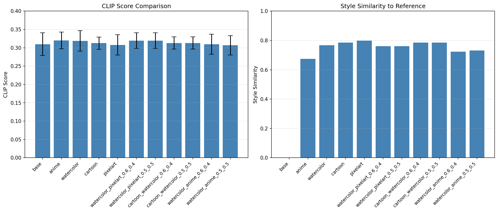

cat > ~/INC_share/JG/CV/README.md << 'EOF'
# 🎨 Multi-Concept LoRA Fine-tuning for Text-to-Image Style Transfer

> **시각지능학습[A] 기말 프로젝트**  
> AI응용학과 2191192 이준구

Stable Diffusion 1.5 기반 다중 스타일 이미지 생성 시스템

---

## 🎯 Project Goal

### 문제점
- **Problem 1**: SD 모델의 스타일 제어 한계 ("anime style" 프롬프트만으로 일관성 X)
- **Problem 2**: Full Fine-tuning 비효율 (4-7GB 모델 재학습)

### 해결 방안
- 4가지 독립 LoRA 학습 (각 3-10MB)
- **Multi-LoRA 조합**으로 새로운 스타일 창출
- 가중치 조절로 무한한 스타일 변형 가능

---

## 📊 Dataset

| 스타일 | 원본 해상도 | 이미지 수 | 출처 | 트리거 워드 |
|--------|------------|----------|------|------------|
| Anime | ~60×60 | 100장 | Kaggle | `anistyle` |
| Watercolor | 416×416 | 100장 | Roboflow | `wcstyle` |
| Cartoon | ~2000×2000 | 60장 | Kaggle | `ctstyle` |
| Pixelart | 16×16 | 100장 | Kaggle | `pixstyle` |

### 전처리 파이프라인
1. **Quality Filter** → Laplacian variance > 100 (블러 이미지 제거)
2. **Resize & Center Crop** → 512×512
3. **BLIP Auto Captioning** → 자동 캡션 생성
4. **Trigger Word 삽입** → `"anistyle, a portrait of..."`

---

## 🛠️ Training

| Parameter | Value |
|-----------|-------|
| Base Model | Stable Diffusion v1.5 |
| LoRA Rank | 32 |
| LoRA Alpha | 16 |
| Learning Rate | 1e-4 |
| Epochs | 20 |
| Batch Size | 2 |
| Optimizer | AdamW |
| Mixed Precision | bf16 |

### Target Modules
- **UNet**: `to_q`, `to_k`, `to_v`, `to_out`
- **Text Encoder**: `q_proj`, `k_proj`, `v_proj`, `out_proj`

---

## 🔀 Multi-LoRA 조합

### 수식
```
h = Wx +  α₁·B₁A₁x +  α₂·B₂A₂x
         └─LoRA 1─┘  └─LoRA 2─┘
```

### 실험 조합

| Multi-LoRA | α₁ | α₂ |
|------------|----|----|
| watercolor + pixelart | 0.6 | 0.4 |
| watercolor + pixelart | 0.5 | 0.5 |
| cartoon + watercolor | 0.6 | 0.4 |
| cartoon + watercolor | 0.5 | 0.5 |
| watercolor + anime | 0.6 | 0.4 |
| watercolor + anime | 0.5 | 0.5 |

---

## 🖼️ Results

### Prompt 0: "a portrait of a young woman in a garden"


### Prompt 1: "a landscape with mountains and sunset"


### Prompt 2: "a cat sitting by a window"


### Prompt 3: "a magical forest scene with glowing lights"


### Prompt 4: "a futuristic cityscape at night"


---

## 📈 Evaluation



### CLIP Score & Style Similarity

| Model | CLIP Score | Style Similarity |
|-------|------------|------------------|
| base | 0.3097 | - |
| anime | **0.3200** | 0.6743 |
| watercolor | 0.3187 | 0.7677 |
| cartoon | 0.3127 | 0.7861 |
| pixelart | 0.3078 | **0.7984** |
| watercolor_pixelart | 0.3196 | 0.7614 |
| cartoon_watercolor | 0.3130 | 0.7858 |
| watercolor_anime | 0.3066 | 0.7321 |

### 주요 발견
- **Best CLIP Score**: anime (0.3200)
- **Best Style Similarity**: pixelart (0.7984)
- **Best Multi-LoRA**: watercolor+pixelart (0.3196)

---

## 🚀 Quick Start
```bash
# 환경 설정
conda create -n lora_env python=3.10 -y
conda activate lora_env
pip install torch==2.2.0 torchvision==0.17.0 --index-url https://download.pytorch.org/whl/cu121
pip install -r requirements.txt

# 전처리
python main.py preprocess --watercolor_dir /path/to/watercolor --cartoon_dir /path/to/cartoon

# 학습
python main.py train --epochs 20 --batch_size 1 --learning_rate 1e-4

# 생성
python main.py inference

# 평가
python main.py evaluate
```

---

## 📁 Project Structure
```
├── main.py                 # CLI 메인
├── requirements.txt        # 의존성
├── scripts/
│   ├── preprocess_data.py  # 전처리 + BLIP
│   ├── train_lora.py       # LoRA 학습
│   ├── inference.py        # Multi-LoRA 추론
│   └── evaluate.py         # 평가
├── results/                # 결과 이미지
└── config/                 # 설정 파일
```

---

## ⚠️ Problems & Solutions

| 문제 | 해결 |
|------|------|
| PyTorch 버전 충돌 | 가상환경 재생성, 호환 버전 통일 |
| LoRA 로딩 오류 | unet_lora/, text_encoder_lora/ 폴더 구조 맞춤 |
| 스타일 미적용 | 트리거 워드 삽입, weight 1.0 설정 |
| Multi-LoRA 충돌 | 가중치 합 1.0 이하로 조절 |
| NaN Loss | mixed_precision="no" 사용 |

---

## 🎯 Conclusion

### 주요 성과
- ✅ 4가지 스타일 LoRA 학습 성공
- ✅ Multi-LoRA 조합으로 새로운 스타일 생성
- ✅ 정량적 평가로 효과 입증 (CLIP Score, Style Similarity)

### 활용 방안
- 아트 디렉션 도구 (게임/애니메이션)
- 개인화 이미지 생성
- 콘텐츠 크리에이터 브랜드 스타일

---

## 📚 References

- [Stable Diffusion v1.5](https://huggingface.co/runwayml/stable-diffusion-v1-5)
- [LoRA Paper](https://arxiv.org/abs/2106.09685)
- [PEFT Documentation](https://huggingface.co/docs/peft)
- [Diffusers Library](https://github.com/huggingface/diffusers)

---

**AI응용학과 2191192 이준구** | 시각지능학습[A] 기말 프로젝트
EOF
